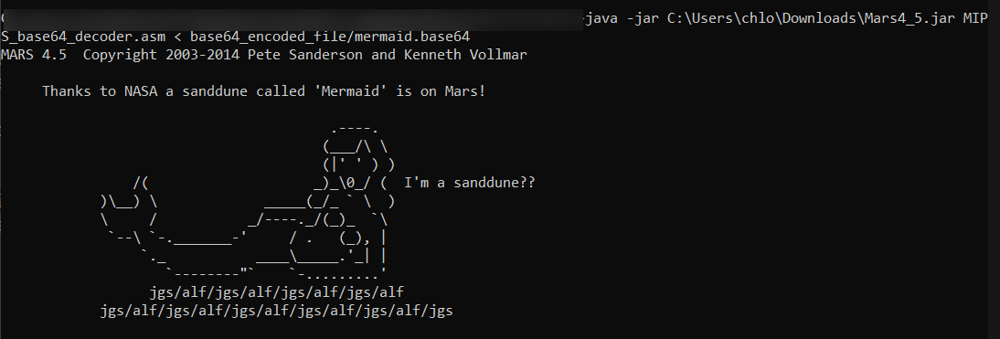

# Assembly-Language
The Assembly Language Programe including MIPS & MARIE.
It includes
- [MIPS Assembly Language (Base 64-decoder written in MIPS)](#mips-assembly-language-base-64-decoder-written-in-mips)
- [MIPS Assembly Language (Several Tasks)](#mips-assembly-language-several-tasks)
- [MARIE Assembly (Simple Database Application)](#marie-assembly-simple-database-application)

## MIPS Assembly Language (Base 64-decoder written in MIPS)

### Objective:
This MIPS program reads lines of Base 64-encoded text from standard input, and outputs the decoded bytes to standard output.

The progam is under folder `MIPS Base64 Decoder`.

### Instructions
1. Download the program that simulator that runs MIPS32 programs, such as SPIM or MARS.     
In this example, we are using [MARS](https://courses.missouristate.edu/kenvollmar/mars/).
2. Change directory to the file directory that contains the MIPS program and run in Command Prompt with format:   
`java -jar [Location_to_MARS_Simulator] [<]Location_to_MIPS_base64_decoder.asm] < [<]Location to the sample encoded file]`  
such as    
`java -jar Mars4_5.jar MIPS_base64_decoder.asm < base64_encoded_file/sample.base64`

## MIPS Assembly Language (Several Tasks)
### Objective:
The task involves implementing several tasks in MIPS assembly language, each corresponding to a specific function. These tasks are initially defined and implemented in Python, then translated into MIPS assembly.

## Tasks:
The tasks is under folder `MIPS Tasks`.

1. **leap_year**: Determines if a given year is a leap year.   

2. **print_list**: Reads a list's size and elements, then prints every other element.
3. **print_list_range**: Reads a list's size and elements, then prints the range (difference between maximum and minimum elements).
4. **count_target_in_list**: Counts the occurrences of a target value in a list.
5. **min_in_list**: Prints the minimum value in a list.
6. **count_frequency_within_range**: Prints the frequency of each value between two given values a and b (such that a < b)
7. **max_in_matrix**: Store a range of temperatures for different cities in a matrix, such that each row represents a city and each column represents a day’s temperature. Then read in the number of days, the number of cities, temperatures for each day and each city, the desired city to print the maximum temperature in such city.

## Instructions:

1. Download and install MARS for MIPS Assembly Language from the provided [link](https://courses.missouristate.edu/kenvollmar/mars/download.htm).
2. Execute the code in the MARS environment.

## MARIE Assembly (Simple Database Application)

### Objective:
Develop a MARIE application to manage unit prerequisites information. The application should accept unit codes as input and output their respective prerequisites.

The unit prerequisite that is stored in the MARIE code is as below:
- for FIT2093, the prerequisites are FIT1045 and FIT1047
- for FIT2100, the prerequisite is FIT1047

The tasks is under folder `MARIE`.

### Instructions:
1. Utilize any MARIE assembly language supporting application for code execution.
2. Enter unit codes ONE character at a time using Unicode encoding. For example, for the input "FIT2093", enter 'f', 'i', 't', '2', '0', '9', '3' where each comma represents a single input.
3. Terminate input with a DECIMAL 0 to signal the end of the string (NOT Unicode).

### Demo:
A video recording of the application demonstration is attached.

https://github.com/chailam/Assembly-Language/assets/30400152/3877438e-c646-46fc-b43e-68c9c5642f4b

